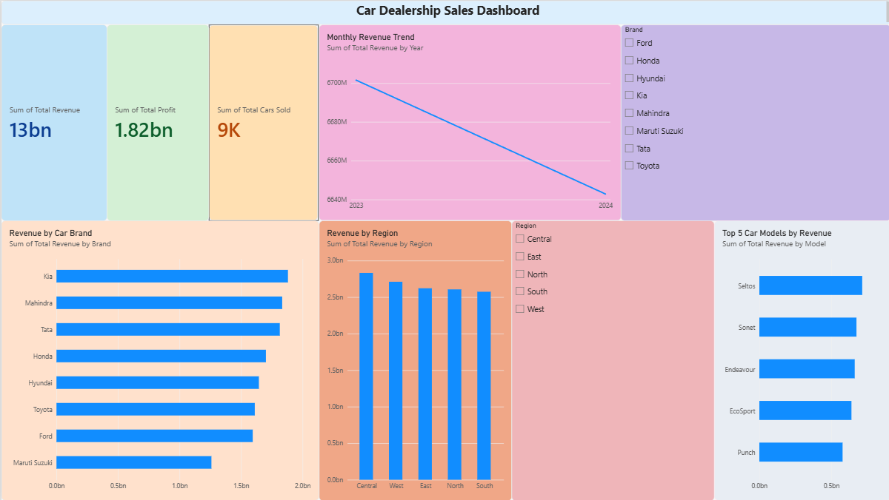

# Car Dealership Sales Dashboard

## Project Overview
This project presents an interactive Car Dealership Sales Dashboard created in Power BI. The dashboard analyzes car sales performance and provides insights into revenue, profit, units sold, brands, regions, models, and sales trends.

## Tools Used
- Power BI Desktop
- Power Query
- DAX
- CSV Dataset

## Dashboard Features
- Total Revenue KPI
- Total Profit KPI
- Total Cars Sold KPI
- Monthly Revenue Trend
- Revenue by Car Brand
- Revenue by Region
- Top 5 Car Models by Revenue
- Brand Slicer
- Region Slicer

## Key Insights
- The dashboard provides an overview of overall dealership performance.
- Revenue and profit can be monitored through KPI cards.
- Brand-wise analysis helps identify high-performing car brands.
- Regional analysis shows differences in sales performance across regions.
- Monthly trends help track changes in revenue over time.
- Interactive slicers allow users to filter the dashboard by brand and region.

## Dashboard Preview

## Project Files
- `Car_Dealership_Sales_Dashboard.pbix` - Power BI dashboard file
- `car_sales.csv` - Dataset used for analysis
- `Car_Dealership_Dashboard.png` - Dashboard preview

## Author
**Rizwan Ali Khoso**
